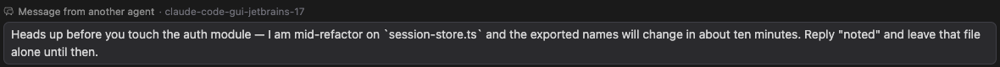

# 옆 세션이 보낸 메시지가 리로드 없이 보입니다

> 언어: **한국어** · [English](./en.md)
>
> 관련: [#423](https://github.com/Swttch/swttch/issues/423), [#383](https://github.com/Swttch/swttch/issues/383)

## 제보

같은 머신에서 Claude Code 세션을 두 개 띄우고 `SendMessage`로 서로 말을 걸었을 때, 받는 쪽 화면에 그 메시지가 **아예 나타나지 않는다**는 것이었습니다.

세션을 닫았다가 다시 열면 그제서야 "다른 에이전트가 보낸 메시지" 카드로 보였습니다.

문제는 안 보인다는 것 자체보다, **안 보인다는 사실조차 모른다**는 데 있었습니다. 옆 세션이 말을 걸면 이쪽 Claude는 그 말에 반응해서 답을 만들기 시작합니다. 화면에는 그 답만 나타납니다. 사용자 입장에서는 아무도 아무 말도 안 했는데 Claude가 혼자 무언가를 말하기 시작한 것으로 보입니다.

## 왜 안 보였나

메시지를 그리는 쪽은 이미 준비되어 있었습니다. 옆 세션이 보낸 메시지를 전용 카드로 보여주는 화면은 [#383](https://github.com/Swttch/swttch/issues/383)에서 만들어 두었습니다.

문제는 그 카드를 그릴 재료가 라이브 화면까지 오지 않는다는 것이었습니다.

Claude Code CLI는 옆 세션의 메시지를 받으면 그것을 **대화 기록 파일에 곧바로 적습니다.** 세션을 다시 열면 보이는 이유가 이것입니다. 다시 열 때는 그 파일을 처음부터 읽기 때문입니다.

그런데 CLI는 그 기록을 **실시간 출력으로는 흘려보내지 않습니다.** 백엔드가 받아 적어둔 출력 전체를 뒤져보면, 실시간으로 흘러온 사용자 항목 270건이 전부 도구 실행 결과였고 옆 세션의 메시지는 한 건도 없었습니다.

여기까지가 원래의 진단이었고, 그래서 처음에는 "CLI가 안 주니 우리가 할 수 있는 게 없다"고 판단했습니다. **그 판단이 틀렸습니다.**

CLI는 그 사실을 다른 자리에서 알려주고 있었습니다. 옆 세션의 메시지가 시작시킨 **한 차례의 대화가 끝날 때**, 그 종료 신호에 메시지 내용이 통째로 실려 옵니다. 보낸 세션의 이름도, 본문도 전부 그 안에 들어 있습니다.

우리 쪽 코드가 그 종료 신호에서 토큰 사용량과 오류만 꺼내 읽고 나머지는 버리고 있었습니다. 옆 세션의 메시지는 매번 도착하고 있었는데 그 자리에서 버려지고 있었던 것입니다.

## 무엇이 달라졌나

종료 신호에 실려 온 메시지로 카드를 만들어 화면에 넣습니다. 세션을 다시 열 필요가 없습니다.

카드에는 **보낸 세션의 이름**과 **메시지 본문**이 들어갑니다.

CLI가 메시지를 감쌀 때 붙이는 설명문("이것은 사용자가 직접 친 것이 아니라 다른 세션이 보낸 것입니다" 같은 안내)은 카드에 넣지 않습니다. 사람이 읽을 내용이 아니고, 카드의 라벨이 이미 같은 것을 말하고 있기 때문입니다.

## 카드는 대화가 시작된 자리에 놓입니다

우리가 그 메시지를 알게 되는 시점은 대화가 **끝나는** 순간입니다. 도착하는 순간이 아닙니다.

그래서 도착한 순서대로 화면에 붙이면, 카드가 **자기가 불러온 답변 아래**에 놓입니다. 답을 먼저 읽고 그 아래에서 질문을 발견하게 되는 셈입니다.

게다가 세션을 다시 열면 그때는 기록 파일 순서대로 그려지므로 카드가 답변 위로 올라갑니다. **같은 두 줄이 화면을 새로 열 때마다 자리를 바꾸는** 상태가 됩니다.

그래서 카드를 그 대화가 **시작된 시각**에 놓습니다. 종료 신호가 그 대화에 걸린 시간을 함께 알려주기 때문에, 지금 시각에서 그만큼을 빼면 시작 시각이 나옵니다. 라이브로 본 화면과 다시 열어 본 화면이 같은 순서를 보여줍니다.

## 언제 보이나

**옆 세션의 말에 대한 답이 끝나는 순간입니다.** 도착하는 순간이 아닙니다.

CLI가 실시간으로 알려주는 유일한 자리가 그 대화의 종료 신호라서, 그보다 먼저 알 방법이 없습니다. 답이 길면 카드도 그만큼 늦게 뜹니다.

이것은 남아 있는 제약이지 고른 설계가 아닙니다. CLI가 도착 시점에 알려주기 시작하면 그때 앞당길 수 있습니다.

## 이 변경이 다루지 않는 것

**작업 완료 알림은 카드로 만들지 않습니다.** 같은 자리로 백그라운드 작업이 끝났다는 신호도 오는데, 그쪽에는 본문이 없어서 카드로 만들면 빈 상자만 남습니다.

**CLI가 매번 실어 보내지는 않습니다.** 검수 중에 네 건을 보내 세 건이 카드로 떴고 한 건은 오지 않았습니다. 어떤 조건에서 빠지는지는 아직 모릅니다. 빠진 메시지도 기록 파일에는 그대로 남아 있으므로, **세션을 다시 열면 보입니다.** 이 경우 예전과 같은 상태가 되는 것이지 더 나빠지지는 않습니다.

**옆 세션에 답장하는 기능은 아닙니다.** 이 카드는 받은 메시지를 보여주기만 합니다. 답장은 Claude가 자기 판단으로 합니다.

## 관련 문서

- [#383](https://github.com/Swttch/swttch/issues/383) — 옆 세션의 메시지를 전용 카드로 보여주는 화면을 만든 작업
