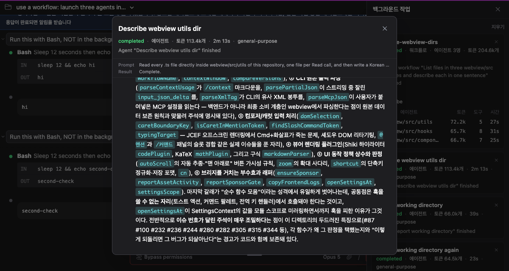
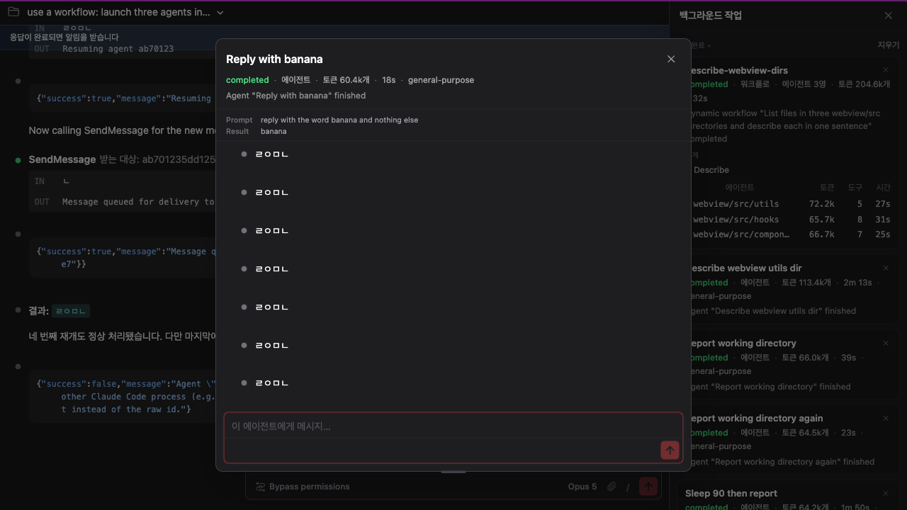
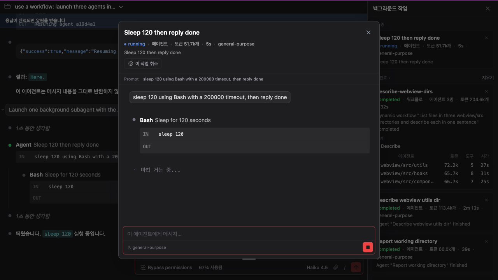
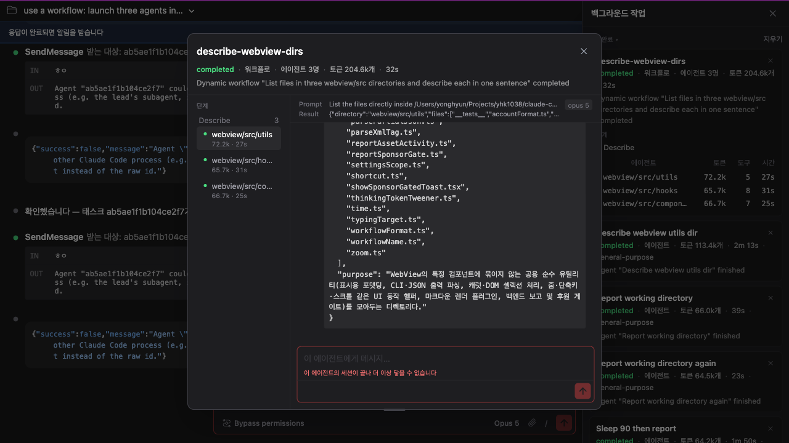

# 백그라운드 에이전트에게 말을 걸 수 있습니다

> 언어: **한국어** · [English](./en.md)
>
> 관련: [#425](https://github.com/Swttch/swttch/issues/425)

## 두 종류의 에이전트

백그라운드 작업 패널에는 성격이 다른 것들이 섞여 있습니다. 이 문서는 그중 둘을 구분해서 부릅니다.

| 부르는 말 | 무엇인가 |
|---|---|
| **워크플로우 에이전트** | 워크플로우 하나가 거느린 여러 에이전트 중 하나. 모달 왼쪽 탭에서 고릅니다 |
| **로컬 에이전트** | `Agent` 도구로 백그라운드에 띄운 에이전트 하나. 그 자체가 작업 하나입니다 |

둘 다 CLI가 쓰는 말을 그대로 가져온 것입니다(`workflow_agent`, `local_agent`).

## 무엇이 달라졌나

### 에이전트가 무엇을 받아서 무엇을 돌려줬는지 보입니다

워크플로우 에이전트에는 **무엇을 물었고 무엇을 답했는지** 보여주는 머리말이 있었는데, 로컬 에이전트에는 대화 기록뿐이었습니다. 같은 종류의 것을 보면서 한쪽만 덜 보여주고 있었습니다.

이제 둘이 **같은 컴포넌트**를 씁니다. 값을 어디서 읽는지만 다르고 생김새는 갈라질 수 없습니다.

`Prompt`는 에이전트가 받은 지시, `Result`는 돌려준 값입니다. 둘 다 대화 기록을 눈으로 훑어서는 알기 어려운 것입니다. 기록은 끝으로 자동 스크롤되기 때문에 처음에 준 지시는 이미 지나가 있고, 반환값은 에이전트가 마지막에 한 말과 다른 것이기 때문입니다.

어떤 종류의 에이전트가 돌았는지(`general-purpose` 같은 것)는 소요시간 오른쪽에 붙습니다.

### 에이전트에게 메시지를 보낼 수 있습니다

에이전트를 지켜보고 중단할 수는 있었지만 말을 걸 수는 없었습니다. 그런데 CLI는 줄곧 그럴 수 있다고 말하고 있었습니다. 작업 완료 알림에 이런 문장이 들어 있습니다.

> the user can send it another message and resume it

**대화 기록 바로 아래**에 입력란이 생겼습니다. 메인 채팅창이 아니라 그 에이전트의 화면에 있는 이유는, 메시지가 그 에이전트에게 가는 것이고 답도 그 기록에 돌아오기 때문입니다.

**워크플로우 에이전트에게도 보낼 수 있습니다.** 이건 GUI만 할 수 있는 일입니다. 워크플로우 에이전트의 주소를 CLI는 모델에게 알려주지 않는데, 우리는 진행 상황 스트림에서 받고 있습니다.

입력란은 메인 채팅창과 **같은 틀**을 씁니다. 테두리와 포커스 표시, 구분선, 하단 바가 한 곳에 정의되어 있고 양쪽이 그것을 가져다 씁니다. 그래서 Enter로 보내고 Shift+Enter로 줄바꿈하는 것, 한글 입력이 끊기지 않는 것, 입력이 길어지면 상자가 늘어나는 것이 양쪽에서 똑같습니다.

첨부와 슬래시 명령 버튼은 **없습니다.** 비활성이 아니라 아예 그리지 않습니다. 에이전트에게 메시지를 전달하는 통로가 문자열 하나만 받아서 첨부를 실을 자리가 없고, 슬래시 명령은 세션에 거는 것이라 에이전트에게는 의미가 없기 때문입니다.

### 보내는 즉시 진행 중인 것이 보이고, 멈출 수 있습니다

메시지를 보내면 전송 버튼이 **그 자리에서** 정지 버튼으로 바뀝니다. CLI가 에이전트를 다시 깨우고 그 사실이 돌아오기까지 기다리지 않습니다. 그 사이에 전송 버튼이 그대로 있으면 아무 일도 일어나지 않은 것처럼 보이기 때문입니다.

정지 버튼은 **보고 있는 그 에이전트만** 멈춥니다. 워크플로우 에이전트를 멈춘다고 워크플로우 전체가 죽지 않습니다.

입력란에 커서가 있을 때 `Esc`를 누르면 모달이 닫히는 대신 에이전트가 멈춥니다. 에이전트가 일하고 있지 않을 때는 그대로 모달이 닫힙니다.

### 닿지 않는 에이전트에서는 입력란이 잠깁니다

에이전트는 자기를 시작한 CLI 세션 안에서만 삽니다. 그 세션이 끝나면 — 프로세스가 재시작되어 새 세션이 대화를 이어받으면 — 이전 에이전트는 다시 깨울 수 없습니다.

이 경우 입력란이 잠기고 이유가 아래에 붉게 표시됩니다.

**미리 알 수는 없습니다.** 닿는 에이전트와 겉모습이 같고, 물어볼 곳도 없습니다. 그래서 한 번 보내보고 거절당한 뒤에 잠깁니다. 상자가 사라지지 않고 자리를 지키는 것은 위쪽 대화 기록이 여전히 읽을 가치가 있기 때문이고, 컨트롤이 사라지면 원래 있었는지조차 헷갈리기 때문입니다.

### 재개한 에이전트가 목록에 두 번 나오지 않습니다

메시지를 보내 에이전트를 다시 깨우면 CLI는 그것을 **새 작업처럼** 알려옵니다. 그대로 받으면 패널에 같은 에이전트가 행 두 개로 늘어나고, 하나는 "완료", 다른 하나는 "실행 중"으로 동시에 앉아 있게 됩니다.

CLI는 이것도 미리 알려주고 있었습니다.

> the same task-id may notify more than once

같은 작업 번호로 다시 온 것은 같은 작업으로 봅니다. 원래 행이 "완료"에서 "실행 중"으로 되돌아가고, 처음에 준 지시와 이후에 보낸 메시지가 순서대로 쌓입니다.

## 같이 고쳐진 것들

이 작업을 하면서 찾은 것들입니다. 원래 이슈와 직접 관련은 없지만 같은 화면에서 드러났습니다.

### 세션을 다시 열면 백그라운드 작업이 하나도 안 보이던 문제

가장 큰 것이었습니다. 세션을 다시 열면 **백그라운드 작업이 전부 사라져** 있었습니다. 워크플로우까지 포함해서 하나도 남지 않았습니다.

복원 과정이 시작하자마자 예외로 중단되고 있었고, 그 실패가 로그에만 적히고 화면에는 아무 말도 없었습니다. 서버 기록에 같은 실패가 여덟 번 남아 있었습니다.

### 백그라운드로 띄우지 않은 명령이 패널에 쌓이던 문제

평범한 `ls` 한 줄도 백그라운드 작업 목록에 행을 만들고 "실행 중" 배지를 올렸습니다. 백그라운드 작업 패널은 **보이지 않는 곳에서 도는 일**을 위한 자리인데, 방금 화면에서 결과를 본 명령이 거기 들어가 있었습니다.

CLI는 어느 쪽인지 매번 알려주고 있었고 우리가 읽지 않았습니다.

실행 중에 백그라운드로 보낸 명령은 그대로 목록에 들어옵니다. CLI가 그 전환도 알려주는데, 그 알림 자체가 통째로 무시되고 있었습니다.

### 작업이 끝났는데 계속 도는 것처럼 보이던 문제

작업이 어떻게 끝났는지 CLI가 직접 알려주는 통로가 있는데 읽지 않고 있었습니다. 그래서 출력 파일을 뒤져 끝난 흔적을 찾는 우회로로 버티고 있었습니다. 이제 알려주는 대로 받습니다.

멈춘 작업의 상태가 화면에 `killed`라고 나오던 것도 고쳤습니다.

## 남은 제약

**실행 중인 에이전트에게 보낸 메시지는 즉시 읽히지 않을 수 있습니다.** 메시지는 접수되지만, 에이전트가 다음번에 도구를 부를 때 전달됩니다. 한 번에 끝나는 짧은 작업 중이라면 읽을 기회 없이 끝날 수 있습니다. 이미 끝난 에이전트에게 보내면 다시 깨어나므로 확실히 처리됩니다.

**메시지 전달은 모델을 거칩니다.** 전달 통로는 모델이 쓰는 도구이고, CLI에서도 사용자가 그것을 직접 부르는 방법은 없습니다. 미문서화 통로로 우회하지 않았습니다.

**닿지 않는 에이전트는 한 번 보내봐야 알 수 있습니다.** 위에 적은 대로입니다.
